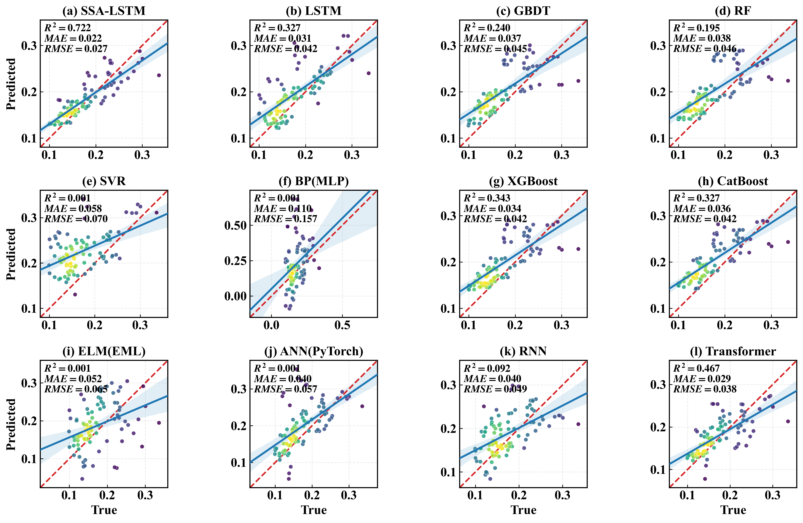
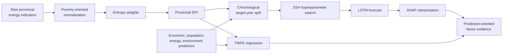

<div align="center">

# Explainable Provincial Energy Poverty Forecasting

### Entropy-weighted EPI · SSA-LSTM · SHAP · Two-way fixed effects

[](https://doi.org/10.3390/systems14030319)


[](https://creativecommons.org/licenses/by/4.0/)

**English** · [简体中文](README.zh-CN.md) · [Paper PDF](paper/systems-14-00319.pdf) · [Published article](https://doi.org/10.3390/systems14030319)

</div>

---

This repository accompanies the open-access article **“Analysis of Influencing Factors and Prediction of Provincial Energy Poverty in China Based on Explainable Deep Learning.”** It provides the province–year data, index-construction scripts, SSA-optimized LSTM code, SHAP analyses, benchmark comparisons, saved model checkpoints, figures, and result workbooks used to study energy poverty across China from 2003 to 2022.

The project links four complementary questions:

1. How can multidimensional provincial energy poverty be summarized as a transparent Energy Poverty Index (EPI)?
2. Can an SSA-optimized LSTM improve time-ordered EPI prediction?
3. Which inputs contribute most to the model’s predictions, globally and across regions?
4. Are the model-interpretation patterns consistent with within-province statistical associations after province and year fixed effects?

> **Interpretation boundary.** SHAP explains contributions to model predictions; TWFE estimates conditional panel associations. Neither result, by itself, establishes a causal effect.



## Study at a glance

| Item | Description |
|---|---|
| Unit of analysis | Province–year |
| Coverage | 30 provincial-level regions, 2003–2022; 600 observations |
| Exclusions | Tibet, Hong Kong, Macao, and Taiwan because of incomplete energy statistics |
| EPI dimensions | Energy Service Accessibility, Energy Consumption Cleanliness, Household Energy Appliances/Access |
| Predictors | 11 economic, population, energy, and environmental variables |
| Forecast model | LSTM with hyperparameters optimized by Sparrow Search Algorithm (SSA) |
| Explainability | SHAP global importance, dependence plots, regional heterogeneity, and index-construction robustness |
| Complementary inference | Province and year fixed effects with lagged predictors |
| Benchmarks | LSTM, GBDT, RF, SVR, BP/MLP, XGBoost, CatBoost, ELM, ANN, RNN, Transformer |

## Research pipeline



## Energy Poverty Index

The EPI is a **provincial composite index**, not a household-only or rural-only measure. All indicators are aligned so that a higher normalized value means more severe energy poverty.

| Dimension | Indicators | Direction in source scale |
|---|---|---|
| Energy Service Accessibility | Per-capita electricity consumption; per-capita natural-gas consumption; urban natural-gas penetration; urban per-capita gas supply; state-owned fixed-asset investment in electricity/steam/hot-water supply | Higher values reduce EPI |
| Energy Consumption Cleanliness | Share of non-thermal generation; per-capita residential SO₂ emissions | Non-thermal share reduces EPI; SO₂ increases EPI |
| Household Energy Appliances/Access | Refrigerators and air conditioners per 100 urban households; range hoods per 100 rural households; rural solar-water-heater coverage per capita | Higher values reduce EPI |

For raw value $x_{ij}$, benefit indicators are reversed and risk indicators are normalized directly:

$$
z_{ij}=
\begin{cases}
\dfrac{\max_i x_{ij}-x_{ij}}{\max_i x_{ij}-\min_i x_{ij}}, & \text{higher source value reduces poverty},\\[8pt]
\dfrac{x_{ij}-\min_i x_{ij}}{\max_i x_{ij}-\min_i x_{ij}}, & \text{higher source value increases poverty}.
\end{cases}
$$

Entropy proportions, entropy, and indicator weights are

$$
p_{ij}=\frac{z_{ij}}{\sum_{i=1}^{m}z_{ij}},
\qquad
e_j=-\frac{1}{\ln m}\sum_{i=1}^{m}p_{ij}\ln p_{ij},
\qquad
w_j=\frac{1-e_j}{\sum_{j=1}^{n}(1-e_j)}.
$$

The provincial index is

$$
\operatorname{EPI}_i=\sum_{j=1}^{n}w_jz_{ij},
$$

so a larger EPI denotes more severe composite energy poverty.

## Prediction variables

| Symbol | Variable | Category |
|---|---|---|
| GDP | GDP per capita | Economic |
| HC | Household consumption | Economic |
| SSI | Share of secondary industry | Economic/industrial |
| PD | Population density | Population |
| UR | Urbanization rate | Population |
| EI | Energy intensity | Energy |
| ECS | Energy-consumption share | Energy |
| PGPC | Power generation per capita | Energy |
| FCR | Forest coverage rate | Environmental |
| LFEEP | Local fiscal environmental-protection expenditure | Environmental |
| WRPC | Water resources per capita | Environmental |

## SSA-LSTM, SHAP, and TWFE

### LSTM state update

For input $x_t$, previous hidden state $h_{t-1}$, and cell state $C_{t-1}$:

$$
f_t=\sigma(W_f[h_{t-1},x_t]+b_f),
\qquad
i_t=\sigma(W_i[h_{t-1},x_t]+b_i),
$$

$$
\widetilde C_t=\tanh(W_C[h_{t-1},x_t]+b_C),
\qquad
C_t=f_t\odot C_{t-1}+i_t\odot\widetilde C_t,
$$

$$
o_t=\sigma(W_o[h_{t-1},x_t]+b_o),
\qquad
h_t=o_t\odot\tanh(C_t).
$$

SSA searches over lookback, hidden size, layer count, dropout, learning rate, and batch size. The fitness minimized by the released implementation is validation RMSE:

$$
\operatorname{RMSE}=\sqrt{\frac{1}{n}\sum_{i=1}^{n}(y_i-\hat y_i)^2}.
$$

### SHAP interpretation

For feature $j$ and feature subsets $S$:

$$
\phi_j=
\sum_{S\subseteq N\setminus\{j\}}
\frac{|S|!(|N|-|S|-1)!}{|N|!}
\left[f(S\cup\{j\})-f(S)\right].
$$

The magnitude $|\phi_j|$ measures contribution strength; its sign shows whether that feature value pushes a particular model output upward or downward relative to the background prediction.

### Two-way fixed effects

The complementary panel model is

$$
\operatorname{EPI}_{it}=\alpha+\boldsymbol\beta^{\mathsf T}X_{i,t-k}
+\mu_i+\lambda_t+\varepsilon_{it},
$$

where $\mu_i$ and $\lambda_t$ are province and year fixed effects. The paper uses $k=3$ as the baseline and reports $k=1,2$ robustness specifications.

## Temporal evaluation design

The released manual-split implementation uses non-overlapping **target years**:

| Split | Target years | Purpose |
|---|---|---|
| Training | 2008–2017 | Parameter estimation |
| Validation | 2018–2019 | SSA fitness and early stopping |
| Testing | 2020–2022 | Final out-of-sample evaluation |

The current SSA result uses a lookback of 10, hidden size 16, 2 LSTM layers, dropout approximately 0.4273, learning rate approximately 0.0210, and batch size 32. These values are stored in `SSA_LSTM_Results_manual_split.xlsx` rather than being universal recommendations.

> **Window-overlap note.** Target-year sets are chronological and non-overlapping, but their historical input windows share earlier calendar years. The released configuration records `STRICT_NO_INPUT_YEAR_OVERLAP=False` and exports the overlap audit. Describe this design as a chronological **target-year** split, not as a fully disjoint input-year partition.

## Main findings reported in the paper

- Provincial EPI generally declines over time in many regions, but substantial east–central–west heterogeneity remains.
- In descriptive correlations, EPI is negatively correlated with GDP ($-0.71$), household consumption ($-0.56$), and urbanization ($-0.63$), while energy intensity is strongly positive ($0.79$).
- On the held-out 2020–2022 target years, SSA-LSTM achieves RMSE 0.027, MAE 0.022, and $R^2=0.722$, compared with RMSE 0.042, MAE 0.031, and $R^2=0.327$ for the baseline LSTM.
- SSA-LSTM also outperforms the reported XGBoost ($R^2=0.343$), CatBoost ($R^2=0.327$), and Transformer ($R^2=0.467$) benchmarks under the same target-year evaluation setting.
- SHAP ranks GDP, energy intensity (EI), and power generation per capita (PGPC) among the strongest contributors to model-predicted EPI variation.
- Regional SHAP profiles differ: central provinces emphasize GDP/EI/PGPC, eastern provinces PGPC/GDP/LFEEP, and western provinces UR/PGPC.
- Alternative EPI constructions—CRITIC, coefficient of variation, deviation maximization, factor analysis, PCA, and a no-urban specification—preserve GDP and EI as leading features.
- TWFE results complement SHAP: EI is positively associated with EPI, while GDP, SSI, ECS, PGPC, and UR are negatively associated in the reported lag specifications. These are associations, not causal estimates.

## Repository structure

```text
the-data-of-energy-poverty-index/
├── README.md
├── README.zh-CN.md
├── paper/
│   └── systems-14-00319.pdf
├── EP数据.xlsx                            # Raw 30-province panel
├── EPI_entropy_output.xlsx                # Convenience copy of EPI and predictors
└── 能源贫困预测CNN-LSTM/
    ├── EP数据(2).xlsx                     # Raw analysis input
    ├── EWM.py                             # Baseline entropy-weighted EPI
    ├── EWM-without 城市项.py              # No-urban sensitivity EPI
    ├── CRITIC-CV-DV.py                    # Alternative objective weights
    ├── CRITIC-因子分析-PCA.py             # CRITIC / FA / PCA robustness
    ├── LSTM.py                            # Baseline LSTM
    ├── SSA-LSTM.py                        # SSA search, final training, checkpointing
    ├── LSTM-SHAP-base.py                  # Baseline SHAP interpretation
    ├── LSTM-SHAP-异质性.py               # Regional heterogeneity
    ├── LSTM-SHAP-鲁棒性.py               # Index-method robustness
    ├── 模型对比＋绘图.py                  # 12-model benchmark and figures
    ├── *.xlsx / *.pth                     # Metrics, predictions, audits, checkpoints
    └── figure/                            # Publication-quality result figures
```

## Artifact catalog

| Artifact | Contents |
|---|---|
| `EP数据.xlsx` / `EP数据(2).xlsx` | 600 province–year observations and 11 EPI source indicators |
| `EPI_entropy_output.xlsx` | `EPI_score`, entropy `Weights`, normalized indicators, and 11 predictors |
| `Exogenous_Variables_and_Table.xlsx` | Chinese/English predictor tables and statistical audit |
| `SSA_LSTM_Results_manual_split.xlsx` | Metrics, best parameters, 200-iteration search history, population records, parameter counts, split metadata, overlap audit |
| `best_SSA_LSTM_checkpoint_manual_split.pth` | Saved state dictionary and preprocessing/model metadata |
| `Model_Comparison_12Models_manual_split.xlsx` | Metrics for 12 models, split configuration, and long-form test predictions |
| `TWFE_EPI_results.xlsx` | Core/standardized TWFE results, model metadata, variable map, and regression data used |
| `SHAP_LSTM_*.png` | Baseline, regional, no-urban, and alternative-index SHAP plots |

The large worksheet maximum row shown by some Excel readers is caused by workbook formatting; the populated panel contains 600 province–year observations.

## Environment

Python 3.10+ is recommended.

```bash
python -m venv .venv
source .venv/bin/activate
python -m pip install numpy pandas openpyxl matplotlib seaborn scipy scikit-learn torch shap xgboost catboost
```

CPU execution is supported. SSA performs repeated LSTM training—50 candidate sparrows over 200 iterations in the released configuration—so a full search is computationally expensive. The saved checkpoint and result workbooks allow inspection without rerunning that search.

## Suggested execution order

Run scripts from the analysis directory because their data paths are relative:

```bash
cd "能源贫困预测CNN-LSTM"
```

1. Build the baseline EPI:

   ```bash
   python EWM.py
   ```

2. Inspect or adjust the constants at the top of `SSA-LSTM.py`, then launch optimization:

   ```bash
   python SSA-LSTM.py
   ```

3. Compare the saved SSA checkpoint with 11 benchmarks:

   ```bash
   python "模型对比＋绘图.py"
   ```

4. Run the SHAP scripts for baseline, regional, or robustness analyses after confirming `DATA_PATH` and output names.

Scripts write Excel and PNG files into the current directory. Use a clean copy or change output paths if you want to preserve the released artifacts byte-for-byte.

## Reproducibility notes

- Random seeds and deterministic PyTorch flags are set where practical, but minor CPU/GPU and library-version differences may remain.
- XGBoost and CatBoost are optional in the benchmark script; missing packages are detected and reported.
- Several SHAP scripts train their own LSTM rather than loading the final SSA checkpoint. Read each script’s header and constants before interpreting cross-file comparisons.
- The repository includes the exported TWFE results and regression data, but not a standalone TWFE estimation script.
- Some files are duplicated at the root and in the analysis directory for convenience; the script-local copies are the default runtime inputs.
- The published article is the authoritative reference for the study design and final reported claims.

## Citation

```bibtex
@article{fan2026energy,
  title   = {Analysis of Influencing Factors and Prediction of Provincial Energy Poverty in China Based on Explainable Deep Learning},
  author  = {Fan, Zihao and Fan, Pengying and Wang, Yile},
  journal = {Systems},
  year    = {2026},
  volume  = {14},
  number  = {3},
  pages   = {319},
  doi     = {10.3390/systems14030319}
}
```

## License

The published article and the PDF in `paper/` are distributed under [CC BY 4.0](https://creativecommons.org/licenses/by/4.0/). No repository-wide license currently covers all code, data, model files, and figures; the article license does not automatically grant the same terms to every separate repository artifact. Contact the authors before redistribution or adaptation beyond legally permitted use.
