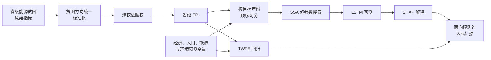

<div align="center">

# 中国省级能源贫困可解释预测

### 熵权 EPI · SSA-LSTM · SHAP · 双向固定效应

[](https://doi.org/10.3390/systems14030319)


[](https://creativecommons.org/licenses/by/4.0/)

[English](README.md) · **简体中文** · [论文 PDF](paper/systems-14-00319.pdf) · [正式发表页面](https://doi.org/10.3390/systems14030319)

</div>

---

本仓库是开放获取论文 **《Analysis of Influencing Factors and Prediction of Provincial Energy Poverty in China Based on Explainable Deep Learning》** 的配套项目，提供 2003—2022 年中国省级面板数据、能源贫困指数构建脚本、SSA 优化的 LSTM、SHAP 分析、多模型比较、模型检查点、图形和结果工作簿。

项目将四类问题连接起来：

1. 如何透明地构建多维省级能源贫困指数（EPI）？
2. SSA 优化能否提升 LSTM 在时间有序评价中的预测能力？
3. 哪些输入变量对模型预测贡献最大，其地区差异如何？
4. 在控制省份与年份固定效应后，模型解释方向是否与省内统计关联一致？

> **解释边界：** SHAP 解释变量对模型预测的贡献，TWFE 估计给定控制条件下的面板关联。两者单独都不能建立因果效应。


## 项目概览

| 项目 | 内容 |
|---|---|
| 分析单元 | 省份—年份 |
| 数据范围 | 30 个省级地区，2003—2022 年，共 600 条观测 |
| 未纳入地区 | 因能源统计不完整，未纳入西藏、香港、澳门和台湾 |
| EPI 维度 | 能源服务可及性、能源消费清洁性、家庭能源设备/可及性 |
| 预测变量 | 11 个经济、人口、能源和环境变量 |
| 预测模型 | Sparrow Search Algorithm（SSA）优化超参数的 LSTM |
| 可解释分析 | SHAP 全局重要性、依赖图、地区异质性与指数构建稳健性 |
| 补充统计分析 | 使用滞后变量的省份和年份双向固定效应 |
| 对比模型 | LSTM、GBDT、RF、SVR、BP/MLP、XGBoost、CatBoost、ELM、ANN、RNN、Transformer |

## 研究流程



## 能源贫困指数

EPI 是 **省级综合指数**，并非仅针对家庭或农村的指标。所有指标都被统一为“标准化值越大，能源贫困越严重”的方向。

| 维度 | 指标 | 原始尺度方向 |
|---|---|---|
| 能源服务可及性 | 人均用电量、人均天然气消费、城市天然气渗透率、城市人均天然气供应量、电力/蒸汽/热水生产供应业国有固定资产投资 | 原始值越高，EPI 越低 |
| 能源消费清洁性 | 非火力发电占比、居民生活 SO₂ 人均排放 | 非火电占比降低 EPI；SO₂ 提高 EPI |
| 家庭能源设备/可及性 | 每百户城镇冰箱、空调，每百户农村抽油烟机，农村太阳能热水器人均覆盖面积 | 原始值越高，EPI 越低 |

对于原始值 $x_{ij}$，保护性指标反向处理，风险性指标正向处理：

$$
z_{ij}=
\begin{cases}
\dfrac{\max_i x_{ij}-x_{ij}}{\max_i x_{ij}-\min_i x_{ij}}, & \text{原始值越高，贫困越轻},\\[8pt]
\dfrac{x_{ij}-\min_i x_{ij}}{\max_i x_{ij}-\min_i x_{ij}}, & \text{原始值越高，贫困越重}.
\end{cases}
$$

熵权法的比例、信息熵和权重为：

$$
p_{ij}=\frac{z_{ij}}{\sum_{i=1}^{m}z_{ij}},
\qquad
e_j=-\frac{1}{\ln m}\sum_{i=1}^{m}p_{ij}\ln p_{ij},
\qquad
w_j=\frac{1-e_j}{\sum_{j=1}^{n}(1-e_j)}.
$$

最终指数为：

$$
\operatorname{EPI}_i=\sum_{j=1}^{n}w_jz_{ij},
$$

因此 EPI 越大表示综合能源贫困越严重。

## 预测变量

| 符号 | 变量 | 类别 |
|---|---|---|
| GDP | 人均地区生产总值 | 经济 |
| HC | 居民消费 | 经济 |
| SSI | 第二产业占比 | 经济/产业 |
| PD | 人口密度 | 人口 |
| UR | 城镇化率 | 人口 |
| EI | 能源消费强度 | 能源 |
| ECS | 能源消费比 | 能源 |
| PGPC | 人均发电量 | 能源 |
| FCR | 森林覆盖率 | 环境 |
| LFEEP | 地方财政环境保护支出 | 环境 |
| WRPC | 人均水资源量 | 环境 |

## SSA-LSTM、SHAP 与 TWFE

### LSTM 状态更新

对于输入 $x_t$、上一时刻隐藏状态 $h_{t-1}$ 和记忆状态 $C_{t-1}$：

$$
f_t=\sigma(W_f[h_{t-1},x_t]+b_f),
\qquad
i_t=\sigma(W_i[h_{t-1},x_t]+b_i),
$$

$$
\widetilde C_t=\tanh(W_C[h_{t-1},x_t]+b_C),
\qquad
C_t=f_t\odot C_{t-1}+i_t\odot\widetilde C_t,
$$

$$
o_t=\sigma(W_o[h_{t-1},x_t]+b_o),
\qquad
h_t=o_t\odot\tanh(C_t).
$$

SSA 搜索回看窗口、隐藏层宽度、层数、Dropout、学习率和批量大小。仓库实现最小化验证集 RMSE：

$$
\operatorname{RMSE}=\sqrt{\frac{1}{n}\sum_{i=1}^{n}(y_i-\hat y_i)^2}.
$$

### SHAP 解释

对于特征 $j$ 和特征子集 $S$：

$$
\phi_j=
\sum_{S\subseteq N\setminus\{j\}}
\frac{|S|!(|N|-|S|-1)!}{|N|!}
\left[f(S\cup\{j\})-f(S)\right].
$$

$|\phi_j|$ 表示贡献强度；符号表示该变量值相对背景预测把本次模型输出推高还是压低。

### 双向固定效应

补充面板模型为：

$$
\operatorname{EPI}_{it}=\alpha+\boldsymbol\beta^{\mathsf T}X_{i,t-k}
+\mu_i+\lambda_t+\varepsilon_{it},
$$

$\mu_i$ 和 $\lambda_t$ 分别为省份、年份固定效应。论文以 $k=3$ 为基准，同时报告 $k=1,2$ 的稳健性设定。

## 时间评价设计

仓库的手动切分实现使用互不重叠的 **目标年份**：

| 数据集 | 目标年份 | 用途 |
|---|---|---|
| 训练集 | 2008—2017 | 参数估计 |
| 验证集 | 2018—2019 | SSA 适应度和早停 |
| 测试集 | 2020—2022 | 最终样本外评价 |

当前 SSA 结果的回看窗口为 10、隐藏层宽度为 16、LSTM 为 2 层、Dropout 约 0.4273、学习率约 0.0210、批量大小为 32。它们记录在 `SSA_LSTM_Results_manual_split.xlsx` 中，是本次搜索结果，不是普适推荐值。

> **窗口重叠说明：** 目标年份集合按时间顺序且互不重叠，但历史输入窗口会共享较早的日历年份。已发布配置记录 `STRICT_NO_INPUT_YEAR_OVERLAP=False` 并导出重叠审计。因此应将其描述为按“目标年份”进行的顺序切分，而不是输入年份完全隔离的切分。

## 论文主要结果

- 多数地区的省级 EPI 随时间下降，但东中西部差异仍然明显。
- 描述性相关分析中，EPI 与 GDP（$-0.71$）、居民消费（$-0.56$）、城镇化率（$-0.63$）负相关，与能源强度（$0.79$）强正相关。
- 在 2020—2022 年目标年份测试集上，SSA-LSTM 的 RMSE 为 0.027、MAE 为 0.022、$R^2=0.722$；基准 LSTM 分别为 0.042、0.031、$R^2=0.327$。
- 在相同目标年份设定下，SSA-LSTM 还优于 XGBoost（$R^2=0.343$）、CatBoost（$R^2=0.327$）和 Transformer（$R^2=0.467$）。
- SHAP 将 GDP、能源强度（EI）和人均发电量（PGPC）列为对模型预测贡献较强的变量。
- 地区 SHAP 结构不同：中部更突出 GDP/EI/PGPC，东部更突出 PGPC/GDP/LFEEP，西部更突出 UR/PGPC。
- CRITIC、变异系数、最大离差、因子分析、PCA 和“去城市项”EPI 等替代构造中，GDP 与 EI 仍保持领先重要性。
- TWFE 为 SHAP 提供补充证据：EI 与 EPI 正相关，而 GDP、SSI、ECS、PGPC、UR 在报告的滞后设定中与 EPI 负相关。上述结果是关联而非因果效应。

## 仓库结构

```text
the-data-of-energy-poverty-index/
├── README.md
├── README.zh-CN.md
├── paper/
│   └── systems-14-00319.pdf
├── EP数据.xlsx                            # 30 省份原始面板
├── EPI_entropy_output.xlsx                # EPI 与预测变量便捷副本
└── 能源贫困预测CNN-LSTM/
    ├── EP数据(2).xlsx                     # 分析原始输入
    ├── EWM.py                             # 基准熵权 EPI
    ├── EWM-without 城市项.py              # 去城市项敏感性 EPI
    ├── CRITIC-CV-DV.py                    # 替代客观赋权
    ├── CRITIC-因子分析-PCA.py             # CRITIC / FA / PCA 稳健性
    ├── LSTM.py                            # 基准 LSTM
    ├── SSA-LSTM.py                        # SSA 搜索、最终训练与检查点
    ├── LSTM-SHAP-base.py                  # 基准 SHAP
    ├── LSTM-SHAP-异质性.py               # 地区异质性
    ├── LSTM-SHAP-鲁棒性.py               # 指数方法稳健性
    ├── 模型对比＋绘图.py                  # 12 模型对比和图形
    ├── *.xlsx / *.pth                     # 指标、预测、审计与模型检查点
    └── figure/                            # 论文级结果图
```

## 主要产物

| 产物 | 内容 |
|---|---|
| `EP数据.xlsx` / `EP数据(2).xlsx` | 600 条省份—年份观测和 11 个 EPI 原始指标 |
| `EPI_entropy_output.xlsx` | `EPI_score`、熵权 `Weights`、标准化指标和 11 个预测变量 |
| `Exogenous_Variables_and_Table.xlsx` | 中英文预测变量表及统计审计 |
| `SSA_LSTM_Results_manual_split.xlsx` | 评价指标、最优参数、200 轮搜索历史、种群记录、参数量、切分元数据和重叠审计 |
| `best_SSA_LSTM_checkpoint_manual_split.pth` | 模型权重及预处理/模型元数据 |
| `Model_Comparison_12Models_manual_split.xlsx` | 12 个模型的指标、切分配置和测试集长表预测 |
| `TWFE_EPI_results.xlsx` | TWFE 核心/标准化结果、模型信息、变量映射及回归使用数据 |
| `SHAP_LSTM_*.png` | 基准、地区、去城市项和替代指数 SHAP 图 |

部分 Excel 阅读器显示的最大行号很大，这是工作簿格式造成的；实际有效面板为 600 条省份—年份观测。

## 环境

建议使用 Python 3.10 或更高版本。

```bash
python -m venv .venv
source .venv/bin/activate
python -m pip install numpy pandas openpyxl matplotlib seaborn scipy scikit-learn torch shap xgboost catboost
```

代码支持 CPU。SSA 在已发布配置下需要对 50 个候选麻雀迭代 200 轮，并反复训练 LSTM，完整搜索计算量较大。可直接检查已保存的检查点和结果工作簿，无需重新搜索。

## 建议运行顺序

脚本使用相对路径，应从分析目录运行：

```bash
cd "能源贫困预测CNN-LSTM"
```

1. 构建基准 EPI：

   ```bash
   python EWM.py
   ```

2. 检查或修改 `SSA-LSTM.py` 顶部常量，再运行优化：

   ```bash
   python SSA-LSTM.py
   ```

3. 使用已保存 SSA 检查点与其他 11 个模型比较：

   ```bash
   python "模型对比＋绘图.py"
   ```

4. 确认 `DATA_PATH` 和输出文件名后，分别运行基准、地区或稳健性 SHAP 脚本。

脚本会向当前目录写入 Excel 和 PNG。若希望逐字节保留已发布产物，请在仓库副本中运行或修改输出路径。

## 可复现注意事项

- 脚本尽可能设置了随机种子和 PyTorch 确定性选项，但 CPU/GPU 和库版本仍可能造成细微差异。
- 多模型脚本把 XGBoost 与 CatBoost 作为可选依赖；缺少时会检测并标记。
- 部分 SHAP 脚本会独立训练 LSTM，而不是读取最终 SSA 检查点。跨文件比较前请阅读各脚本顶部说明和参数。
- 仓库公开了 TWFE 结果和回归使用数据，但目前没有独立的 TWFE 估计脚本。
- 根目录和分析目录存在便捷副本；脚本默认读取分析目录中的文件。
- 研究设计与最终结论以正式发表论文为准。

## 引用方式

```bibtex
@article{fan2026energy,
  title   = {Analysis of Influencing Factors and Prediction of Provincial Energy Poverty in China Based on Explainable Deep Learning},
  author  = {Fan, Zihao and Fan, Pengying and Wang, Yile},
  journal = {Systems},
  year    = {2026},
  volume  = {14},
  number  = {3},
  pages   = {319},
  doi     = {10.3390/systems14030319}
}
```

## 许可

正式论文及 `paper/` 中的 PDF 按 [CC BY 4.0](https://creativecommons.org/licenses/by/4.0/) 发布。仓库目前没有覆盖全部代码、数据、模型文件和图形的统一许可；论文许可不会自动赋予每个独立仓库产物相同条款。若需在法定使用范围之外重新分发或改编，请先联系作者。
